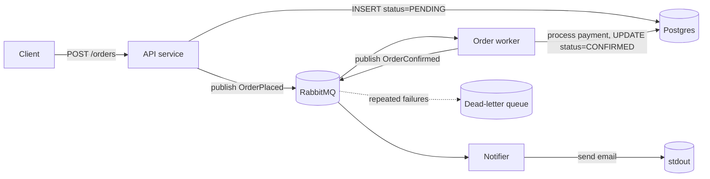

# Project: Event-Driven Order Processing

> Build a small but complete order system where services talk through **events**, not
> direct calls — so an order is accepted instantly and processed asynchronously by workers.
> This is the backbone pattern behind checkout, payments, and fulfillment everywhere.

⏱️ ~30–40 min · 💰 free locally · 🐳 Docker · ☁️ AWS optional

## What you'll build
A checkout flow split into independent services connected by a message broker:



The API returns in milliseconds; payment and notifications happen **after**, in the
background. The order is `PENDING` then becomes `CONFIRMED` — **eventual consistency** you
can watch happen.

## Concepts you connect
- [Message queues & pub/sub](../1-knowledge/building-blocks/message-queues.md) — the broker
- [Sync vs async communication](../1-knowledge/communication/sync-vs-async.md) — why the API
  doesn't wait
- [Event-driven architecture](../1-knowledge/patterns/event-driven.md) — services react to events
- Idempotency & DLQ — from the [notification system case study](../2-case-studies/notification-system.md)
- [SQL](../1-knowledge/data-storage/sql-vs-nosql.md) for the order of record

## Build it locally (🐳)

**1. `db.sql`** — order table:
```sql
CREATE TABLE orders (
  id TEXT PRIMARY KEY,
  item TEXT,
  status TEXT NOT NULL DEFAULT 'PENDING',
  updated_at TIMESTAMPTZ DEFAULT now()
);
```

**2. `api.py`** — accept an order, persist as PENDING, publish `OrderPlaced`:
```python
import os, json, uuid, pika, psycopg2
from flask import Flask, request
app = Flask(__name__)

def db(): return psycopg2.connect(os.environ["DB"])
def mq():
    c = pika.BlockingConnection(pika.URLParameters(os.environ["MQ"]))
    ch = c.channel(); ch.exchange_declare("orders", "topic", durable=True)
    return c, ch

@app.post("/orders")
def create():
    oid = str(uuid.uuid4())[:8]
    item = request.json.get("item", "widget")
    con = db(); cur = con.cursor()
    cur.execute("INSERT INTO orders(id,item) VALUES(%s,%s)", (oid, item)); con.commit()
    c, ch = mq()
    ch.basic_publish("orders", "order.placed",
                     json.dumps({"id": oid, "item": item}),
                     pika.BasicProperties(delivery_mode=2))
    c.close()
    return {"order_id": oid, "status": "PENDING"}, 202   # returns immediately

@app.get("/orders/<oid>")
def get(oid):
    cur = db().cursor(); cur.execute("SELECT id,item,status FROM orders WHERE id=%s",(oid,))
    r = cur.fetchone()
    return {"id": r[0], "item": r[1], "status": r[2]} if r else ({"error":"not found"}, 404)
```

**3. `worker.py`** — consume `OrderPlaced`, "charge", confirm, publish `OrderConfirmed`:
```python
import os, json, time, pika, psycopg2

con = psycopg2.connect(os.environ["DB"]); con.autocommit = True
c = pika.BlockingConnection(pika.URLParameters(os.environ["MQ"])); ch = c.channel()
ch.exchange_declare("orders", "topic", durable=True)
# main queue + a dead-letter queue for poison messages
ch.queue_declare("order.process", durable=True,
                 arguments={"x-dead-letter-exchange": "orders",
                            "x-dead-letter-routing-key": "order.dead"})
ch.queue_bind("order.process", "orders", "order.placed")
ch.queue_declare("order.dead", durable=True); ch.queue_bind("order.dead","orders","order.dead")

def handle(chx, method, props, body):
    o = json.loads(body)
    print(f"[worker] processing {o['id']}")
    time.sleep(1)                                   # pretend: charge the card
    # idempotent: only PENDING -> CONFIRMED, so a redelivery is a no-op
    cur = con.cursor()
    cur.execute("UPDATE orders SET status='CONFIRMED',updated_at=now() "
                "WHERE id=%s AND status='PENDING'", (o["id"],))
    chx.basic_publish("orders","order.confirmed", body)
    chx.basic_ack(method.delivery_tag)
    print(f"[worker] confirmed {o['id']}")

ch.basic_qos(prefetch_count=1)
ch.basic_consume("order.process", handle)
print("[worker] waiting for orders..."); ch.start_consuming()
```

**4. `notifier.py`** — consume `OrderConfirmed`, "send email":
```python
import os, json, pika
c = pika.BlockingConnection(pika.URLParameters(os.environ["MQ"])); ch = c.channel()
ch.exchange_declare("orders","topic",durable=True)
ch.queue_declare("order.notify", durable=True); ch.queue_bind("order.notify","orders","order.confirmed")
def handle(chx, m, p, body):
    o = json.loads(body); print(f"[notifier] 📧 emailing customer about {o['id']}")
    chx.basic_ack(m.delivery_tag)
ch.basic_consume("order.notify", handle); print("[notifier] waiting..."); ch.start_consuming()
```

**5. `docker-compose.yml`** — wire it all together:
```yaml
services:
  db:
    image: postgres:16-alpine
    environment: { POSTGRES_PASSWORD: pass, POSTGRES_DB: shop }
    volumes: [ "./db.sql:/docker-entrypoint-initdb.d/db.sql" ]
  mq:
    image: rabbitmq:3-management
    ports: [ "15672:15672" ]      # management UI: guest/guest
  api:
    image: python:3.12-slim
    working_dir: /app
    volumes: [ "./api.py:/app/api.py" ]
    command: sh -c "pip install flask pika psycopg2-binary -q && flask run --host 0.0.0.0"
    environment:
      DB: "host=db dbname=shop user=postgres password=pass"
      MQ: "amqp://guest:guest@mq:5672/"
    ports: [ "5000:5000" ]
    depends_on: [ db, mq ]
  worker:
    image: python:3.12-slim
    working_dir: /app
    volumes: [ "./worker.py:/app/worker.py" ]
    command: sh -c "pip install pika psycopg2-binary -q && sleep 8 && python worker.py"
    environment: { DB: "host=db dbname=shop user=postgres password=pass", MQ: "amqp://guest:guest@mq:5672/" }
    depends_on: [ db, mq ]
  notifier:
    image: python:3.12-slim
    working_dir: /app
    volumes: [ "./notifier.py:/app/notifier.py" ]
    command: sh -c "pip install pika -q && sleep 8 && python notifier.py"
    environment: { MQ: "amqp://guest:guest@mq:5672/" }
    depends_on: [ mq ]
```

```bash
docker compose up -d
sleep 15   # let rabbitmq + pip installs settle
```

## Run the end-to-end flow
```bash
# 1. Place an order — returns instantly as PENDING (202)
curl -s -X POST localhost:5000/orders -H 'content-type: application/json' \
  -d '{"item":"keyboard"}'

# 2. Immediately fetch it — still PENDING (worker hasn't finished)
OID=$(curl -s -X POST localhost:5000/orders -d '{"item":"mouse"}' -H 'content-type: application/json' | python -c "import sys,json;print(json.load(sys.stdin)['order_id'])")
curl -s localhost:5000/orders/$OID         # status: PENDING

# 3. Wait ~2s and fetch again — now CONFIRMED (processed asynchronously)
sleep 2; curl -s localhost:5000/orders/$OID   # status: CONFIRMED

# 4. Watch the services react via events
docker compose logs worker notifier | tail -20
```

## What to observe & why
- The API responds **immediately with `PENDING`** (HTTP 202) — it only wrote a row and
  dropped an event on the broker; it did **not** wait for payment. That's
  **async decoupling**: the slow work happens off the request path.
- A moment later the same order reads **`CONFIRMED`** — the worker consumed `OrderPlaced`,
  "charged the card," and updated the row. You just watched **eventual consistency**.
- The **notifier** reacted to `OrderConfirmed` without the worker knowing it exists — add a
  third consumer (analytics) and neither the API nor the worker changes. That's the
  **loose coupling** payoff of events.

## Deploy / scale on AWS (☁️)
Each local component maps to a managed service:

| Local | AWS managed | Role |
| --- | --- | --- |
| Flask API | **API Gateway + Lambda** or **ECS Fargate** | accept orders |
| RabbitMQ | **SQS** (queue) + **SNS/EventBridge** (fan-out) | the event backbone |
| worker / notifier | **Lambda** (SQS-triggered) or ECS services | consumers |
| Postgres | **RDS** | order of record |
| email print | **SES** | real notifications |
| dead-letter queue | **SQS DLQ** + redrive policy | poison-message handling |

Pattern: `API Gateway → Lambda (writes RDS + publishes SNS) → SNS fans out to SQS queues →
Lambda consumers`. Throughput scales automatically; SQS absorbs spikes. See the
[SQS+SNS lab](./aws/queue-sqs-sns.md) for the messaging primitives.

## Observe & break it
1. **Scale the workers:** `docker compose up -d --scale worker=3`, fire 20 orders in a loop,
   and watch the 3 workers **share the load** (competing consumers on one queue).
2. **Worker down = nothing lost:** `docker compose stop worker`, place orders (they stay
   `PENDING`), then `start worker` — the queued events drain and orders become `CONFIRMED`.
   The broker **buffered** the work. This is the resilience async buys you.
3. **Dead-letter queue:** make the worker `raise` on a specific item and `nack` without
   requeue; that message lands in `order.dead`. Inspect it in the RabbitMQ UI
   (localhost:15672, guest/guest).
4. **Idempotency:** re-publish the same `OrderPlaced` — the `WHERE status='PENDING'` guard
   makes the second processing a **no-op**, so duplicates (which at-least-once delivery
   guarantees) don't double-charge.

## Extend it
- Add an **inventory** service consuming `OrderPlaced` (reserve stock) → you now need a
  [saga](./project-saga.md) to handle "payment ok but out of stock."
- Add **idempotency keys** in a Redis dedup store (from the
  [notification project](./project-notification-service.md)).
- Add **observability** ([cross-cutting lab](./cross-observability.md)) to trace one order
  across all services.

## Mirrors
This is the core of real **checkout/fulfillment** systems and the
[notification system](../2-case-studies/notification-system.md) case study — and the same
event backbone Uber/Netflix/LinkedIn run on Kafka.

## Teardown
```bash
docker compose down -v
```
