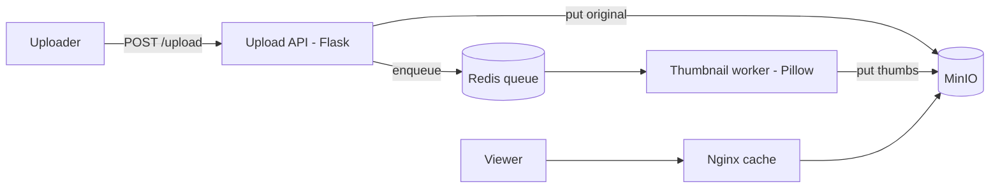

# Project: Image Upload & Processing

> Build an image service: upload an image, store the original in object storage, and let a
> background worker generate thumbnails served via a CDN — the event-driven media pattern
> (the same shape as the [video project](./project-video-streaming.md), simpler).

⏱️ ~25 min · 💰 free locally · 🐳 Docker · 🐍 Python (Pillow) · ☁️ AWS optional

## What you'll build


## Concepts you connect
- [Object storage](../1-knowledge/data-storage/object-storage.md) · [CDN](../1-knowledge/building-blocks/cdn.md)
- [Event-driven processing](./project-event-driven-orders.md) (async jobs)

## Build it locally (🐳)

**1. `api.py`:**
```python
import os, uuid, redis, boto3
from flask import Flask, request
app = Flask(__name__)
s3 = boto3.client("s3", endpoint_url="http://minio:9000",
                  aws_access_key_id="minioadmin", aws_secret_access_key="minioadmin")
q = redis.Redis(host="redis", port=6379)
try: s3.create_bucket(Bucket="images")
except Exception: pass

@app.post("/upload")
def upload():
    iid = str(uuid.uuid4())[:8]
    s3.put_object(Bucket="images", Key=f"{iid}/original", Body=request.get_data())
    q.lpush("thumbs", iid)
    return {"image_id": iid, "status": "PROCESSING"}, 202
```

**2. `worker.py`** — generate thumbnails with Pillow:
```python
import io, redis, boto3
from PIL import Image
s3 = boto3.client("s3", endpoint_url="http://minio:9000",
                  aws_access_key_id="minioadmin", aws_secret_access_key="minioadmin")
q = redis.Redis(host="redis", port=6379)
SIZES = {"small": (100, 100), "medium": (400, 400)}
while True:
    _, iid = q.brpop("thumbs"); iid = iid.decode()
    obj = s3.get_object(Bucket="images", Key=f"{iid}/original")["Body"].read()
    for name, size in SIZES.items():
        img = Image.open(io.BytesIO(obj)); img.thumbnail(size)
        buf = io.BytesIO(); img.save(buf, "JPEG"); buf.seek(0)
        s3.upload_fileobj(buf, "images", f"{iid}/{name}.jpg")
        print(f"[worker] {iid} -> {name} {size}")
```

**3. `nginx.conf`** (CDN cache, same as the video project):
```nginx
events {}
http {
  proxy_cache_path /tmp/c levels=1:2 keys_zone=cdn:10m max_size=1g;
  server { listen 80; location / { proxy_cache cdn; add_header X-Cache $upstream_cache_status;
           proxy_pass http://minio:9000/images/; } }
}
```

**4. `docker-compose.yml`:**
```yaml
services:
  minio:
    image: minio/minio
    command: server /data --console-address ":9001"
    environment: { MINIO_ROOT_USER: minioadmin, MINIO_ROOT_PASSWORD: minioadmin }
    ports: [ "9001:9001" ]
  redis: { image: redis:7-alpine }
  api:
    image: python:3.12-slim
    volumes: [ "./api.py:/app/api.py" ]
    working_dir: /app
    command: sh -c "pip install flask boto3 redis -q && flask run --host 0.0.0.0"
    environment: { FLASK_APP: api.py }
    ports: [ "5000:5000" ]
    depends_on: [ minio, redis ]
  worker:
    image: python:3.12-slim
    volumes: [ "./worker.py:/app/worker.py" ]
    working_dir: /app
    command: sh -c "pip install boto3 redis pillow -q && sleep 6 && python worker.py"
    depends_on: [ minio, redis ]
  cdn:
    image: nginx:alpine
    volumes: [ "./nginx.conf:/etc/nginx/nginx.conf:ro" ]
    ports: [ "8080:80" ]
    depends_on: [ minio ]
```

```bash
docker compose up -d
sleep 12
```

## Run the end-to-end flow
```bash
curl -s -X POST --data-binary @photo.jpg localhost:5000/upload   # -> {image_id, PROCESSING}
docker compose logs worker | tail
# fetch a thumbnail via the CDN (note X-Cache MISS then HIT)
curl -sI localhost:8080/<image_id>/small.jpg | grep -i x-cache
curl -sI localhost:8080/<image_id>/small.jpg | grep -i x-cache
```
> No image? `python -c "from PIL import Image; Image.new('RGB',(1200,1200),'blue').save('photo.jpg')"`

## What to observe & why
- Upload returns `202` immediately; thumbnailing happens in the **worker** — the upload path
  isn't blocked by image processing.
- The worker reads the original from object storage, makes **small/medium** versions, and
  writes them back — the **store original, derive variants async** pattern.
- Second fetch of a thumbnail is `X-Cache: HIT` — served from the Nginx edge, not MinIO.

## Deploy / scale on AWS (☁️)
| Local | AWS managed |
| --- | --- |
| MinIO | **S3** |
| upload | **S3 presigned URL** (client → S3) |
| Redis queue | **S3 event → SQS/Lambda** |
| Pillow worker | **Lambda** (or ECS) |
| Nginx cache | **CloudFront** |

The classic serverless variant: **S3 put event → Lambda → writes thumbnails back to S3 →
CloudFront**. No servers to run.

## Observe & break it
1. **Async resilience:** stop the worker, upload several images (queued), restart → backlog
   drains.
2. **Scale:** `--scale worker=3` for parallel processing.
3. **Presigned uploads:** generate a presigned PUT URL with boto3 so big images go straight
   to storage, off your API.

## Mirrors
The blob pattern in [Instagram](../2-case-studies/companies/instagram.md) and the async
media pipeline in [video streaming](../2-case-studies/video-streaming.md).

## Teardown
```bash
docker compose down -v
```
