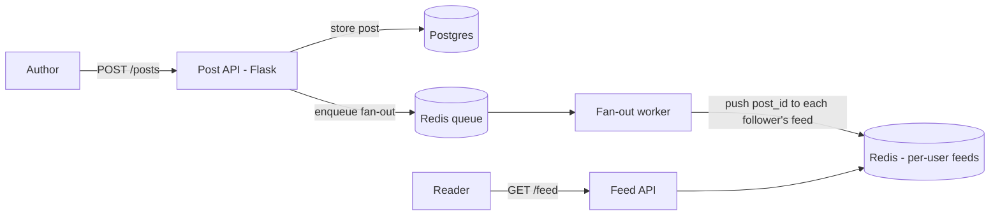

# Project: News Feed (Fan-out)

> Build a social feed that demonstrates the **fan-out-on-write** pattern (and the
> celebrity problem) from the [news feed case study](../2-case-studies/news-feed.md): when
> you post, the post is pushed into your followers' precomputed feeds.

⏱️ ~30 min · 💰 free locally · 🐳 Docker · 🐍 Python · ☁️ AWS optional

## What you'll build


A post is stored once, then a worker **pushes its id into every follower's feed list**, so
reading a feed is a fast cache lookup — not a query across everyone you follow.

## Concepts you connect
- Fan-out on write / pull / hybrid — the [news feed case study](../2-case-studies/news-feed.md)
- [Caching](../1-knowledge/building-blocks/caching.md) (per-user feed lists in Redis)
- [Message queues](../1-knowledge/building-blocks/message-queues.md) (async fan-out)

## Build it locally (🐳)

**1. `db.sql`:**
```sql
CREATE TABLE posts (id SERIAL PRIMARY KEY, author INT, body TEXT, created_at TIMESTAMPTZ DEFAULT now());
CREATE TABLE follows (follower INT, followee INT);
```

**2. `api.py`** — post (enqueue fan-out), feed (read cache), follow:
```python
import os, json, redis, psycopg2
from flask import Flask, request
app = Flask(__name__)
r = redis.Redis(host="redis", port=6379)
def db(): return psycopg2.connect(os.environ["DB"])

@app.post("/follow")
def follow():
    d = request.json
    con = db(); con.cursor().execute("INSERT INTO follows VALUES(%s,%s)",
                                      (d["follower"], d["followee"])); con.commit()
    return {"ok": True}

@app.post("/posts")
def post():
    d = request.json
    con = db(); cur = con.cursor()
    cur.execute("INSERT INTO posts(author,body) VALUES(%s,%s) RETURNING id",
                (d["author"], d["body"])); pid = cur.fetchone()[0]; con.commit()
    r.lpush("fanout", json.dumps({"post_id": pid, "author": d["author"]}))  # async fan-out
    return {"post_id": pid}, 202

@app.get("/feed/<int:user>")
def feed(user):
    ids = r.lrange(f"feed:{user}", 0, 20)                 # fast cache read
    return {"feed": [int(i) for i in ids]}
```

**3. `fanout.py`** — push each new post into followers' feeds:
```python
import os, json, redis, psycopg2
r = redis.Redis(host="redis", port=6379)
con = psycopg2.connect(os.environ["DB"]); con.autocommit = True
while True:
    _, job = r.brpop("fanout"); j = json.loads(job)
    cur = con.cursor()
    cur.execute("SELECT follower FROM follows WHERE followee=%s", (j["author"],))
    followers = [row[0] for row in cur.fetchall()]
    pipe = r.pipeline()
    for f in followers:
        pipe.lpush(f"feed:{f}", j["post_id"]); pipe.ltrim(f"feed:{f}", 0, 799)  # cap feed
    pipe.execute()
    print(f"[fanout] post {j['post_id']} -> {len(followers)} followers")
```

**4. `docker-compose.yml`:**
```yaml
services:
  db:
    image: postgres:16-alpine
    environment: { POSTGRES_PASSWORD: pass, POSTGRES_DB: feed }
    volumes: [ "./db.sql:/docker-entrypoint-initdb.d/db.sql" ]
  redis: { image: redis:7-alpine }
  api:
    image: python:3.12-slim
    volumes: [ "./api.py:/app/api.py" ]
    working_dir: /app
    command: sh -c "pip install flask redis psycopg2-binary -q && flask run --host 0.0.0.0"
    environment: { FLASK_APP: api.py, DB: "host=db dbname=feed user=postgres password=pass" }
    ports: [ "5000:5000" ]
    depends_on: [ db, redis ]
  fanout:
    image: python:3.12-slim
    volumes: [ "./fanout.py:/app/fanout.py" ]
    working_dir: /app
    command: sh -c "pip install redis psycopg2-binary -q && sleep 8 && python fanout.py"
    environment: { DB: "host=db dbname=feed user=postgres password=pass" }
    depends_on: [ db, redis ]
```

```bash
docker compose up -d
sleep 12
```

## Run the end-to-end flow
```bash
# users 2 and 3 follow user 1
curl -s -X POST localhost:5000/follow -d '{"follower":2,"followee":1}' -H 'content-type: application/json'
curl -s -X POST localhost:5000/follow -d '{"follower":3,"followee":1}' -H 'content-type: application/json'

# user 1 posts
curl -s -X POST localhost:5000/posts -d '{"author":1,"body":"hello world"}' -H 'content-type: application/json'
sleep 1

# users 2 and 3 now have it in their precomputed feeds
curl -s localhost:5000/feed/2
curl -s localhost:5000/feed/3
```

## What to observe & why
- Posting returns `202` immediately and just enqueues a fan-out job — the expensive
  "deliver to all followers" work happens in the **worker**, not on the request.
- A moment later, followers 2 and 3 have the post_id in `feed:<id>` — the feed was
  **precomputed at write time**, so the read (`GET /feed`) is a single `LRANGE`, not a join
  across `follows` + `posts`.
- The feed is **capped** (`LTRIM` to 800) — you store ids, not full posts, and bound memory.

## Deploy / scale on AWS (☁️)
| Local | AWS managed |
| --- | --- |
| Postgres (posts/graph) | **RDS** / **DynamoDB** |
| Redis feed lists | **ElastiCache** / DynamoDB |
| Redis fan-out queue | **SQS** |
| fan-out worker | **Lambda** (SQS-triggered) |

## Observe & break it
1. **The celebrity problem:** make user 1 have 100k followers (bulk-insert `follows`) and
   post — watch the single fan-out job do 100k writes (a spike). This is exactly why real
   feeds switch celebrities to **pull at read time** (hybrid). Implement it: skip fan-out if
   `followers > 10000`, and have `GET /feed` merge in such authors' recent posts.
2. **Async resilience:** stop the fan-out worker, post a few times, restart — the backlog
   drains and feeds catch up.
3. **Scale workers:** `--scale fanout=3` to split the fan-out load.

## Extend it
- Add **ranking** (score by recency/affinity) instead of pure chronological.
- Hydrate ids → full posts from a posts cache.
- Add the [streaming pipeline](./project-streaming-data.md) for engagement metrics.

## Mirrors
The [news feed case study](../2-case-studies/news-feed.md) — Twitter/Instagram fan-out.

## Teardown
```bash
docker compose down -v
```
