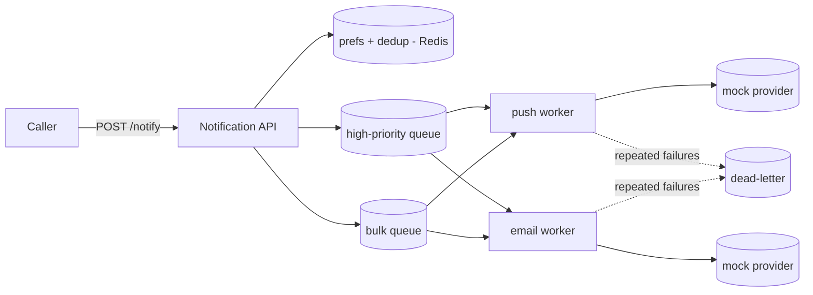

# Project: Multi-Channel Notification Service

> Build a notification service that fans a request out to multiple channels (push / SMS /
> email) through **per-channel queues**, with **retries + dead-letter**, **idempotency**,
> and **priority lanes** — the [notification system case study](../2-case-studies/notification-system.md)
> made runnable.

⏱️ ~30 min · 💰 free locally · 🐳 Docker · 🐍 Python · ☁️ AWS optional

## What you'll build


A request is validated (opt-outs, dedup), then enqueued per channel; workers deliver with
retries and route poison messages to a DLQ. Urgent traffic uses a separate lane so a bulk
blast can't delay an OTP.

## Concepts you connect
- Async fan-out, retries, DLQ, idempotency, priority lanes —
  [notification system case study](../2-case-studies/notification-system.md)
- [Message queues](../1-knowledge/building-blocks/message-queues.md)
- [Idempotency](./project-event-driven-orders.md) (dedup keys)

## Build it locally (🐳)

**1. `api.py`** — validate, dedup, enqueue per channel + priority:
```python
import os, json, redis, time
from flask import Flask, request
app = Flask(__name__)
r = redis.Redis(host="redis", port=6379)

@app.post("/notify")
def notify():
    d = request.json                       # {user, channels:[...], text, priority, dedup_key}
    # 1. idempotency: skip if we've seen this dedup_key recently
    if d.get("dedup_key") and not r.set(f"dedup:{d['dedup_key']}", 1, nx=True, ex=3600):
        return {"status": "duplicate-skipped"}, 200
    # 2. preference check (opt-out)
    if r.sismember("optout", d["user"]):
        return {"status": "opted-out"}, 200
    # 3. enqueue per channel on the right priority lane
    lane = "q:high" if d.get("priority") == "high" else "q:bulk"
    for ch in d["channels"]:
        r.lpush(lane, json.dumps({"channel": ch, "user": d["user"], "text": d["text"]}))
    return {"status": "queued"}, 202
```

**2. `worker.py`** — drain high-priority first, deliver with retries + DLQ:
```python
import os, json, time, random, redis
r = redis.Redis(host="redis", port=6379)

def deliver(job):
    if random.random() < 0.3:               # simulate a flaky provider (30% fail)
        raise RuntimeError("provider error")
    print(f"[{job['channel']}] -> user {job['user']}: {job['text']}")

while True:
    # priority: always check the high lane before the bulk lane
    item = r.rpop("q:high") or r.rpop("q:bulk")
    if not item:
        time.sleep(0.2); continue
    job = json.loads(item); job.setdefault("attempts", 0)
    try:
        deliver(job)
    except Exception as e:
        job["attempts"] += 1
        if job["attempts"] < 3:
            time.sleep(2 ** job["attempts"] * 0.1)        # exponential backoff
            r.lpush("q:bulk", json.dumps(job))            # requeue (retry)
            print(f"[retry] {job['channel']} attempt {job['attempts']}")
        else:
            r.lpush("dlq", json.dumps(job))               # dead-letter
            print(f"[DLQ] gave up on {job}")
```

**3. `docker-compose.yml`:**
```yaml
services:
  redis: { image: redis:7-alpine }
  api:
    image: python:3.12-slim
    volumes: [ "./api.py:/app/api.py" ]
    working_dir: /app
    command: sh -c "pip install flask redis -q && flask run --host 0.0.0.0"
    environment: { FLASK_APP: api.py }
    ports: [ "5000:5000" ]
    depends_on: [ redis ]
  worker:
    image: python:3.12-slim
    volumes: [ "./worker.py:/app/worker.py" ]
    working_dir: /app
    command: sh -c "pip install redis -q && sleep 5 && python worker.py"
    depends_on: [ redis ]
```

```bash
docker compose up -d
sleep 8
```

## Run the end-to-end flow
```bash
# A high-priority OTP to push + SMS
curl -s -X POST localhost:5000/notify -H 'content-type: application/json' \
  -d '{"user":1,"channels":["push","sms"],"text":"Your code: 1234","priority":"high","dedup_key":"otp-1"}'

# Re-send the SAME dedup_key -> skipped (idempotent)
curl -s -X POST localhost:5000/notify -H 'content-type: application/json' \
  -d '{"user":1,"channels":["push"],"text":"Your code: 1234","priority":"high","dedup_key":"otp-1"}'

# A bulk marketing blast
curl -s -X POST localhost:5000/notify -H 'content-type: application/json' \
  -d '{"user":2,"channels":["email"],"text":"Big sale!","priority":"bulk"}'

docker compose logs worker | tail -20
docker compose exec redis redis-cli lrange dlq 0 -1     # anything that failed 3x
```

## What to observe & why
- The API returns `202` instantly — it only validated + enqueued; delivery is async.
- The **second OTP with the same `dedup_key`** returns `duplicate-skipped` — the
  `SET NX` idempotency guard prevents double-sending (at-least-once → effectively-once).
- Worker logs show **retries with backoff** on simulated provider failures, and messages
  that fail 3× land in the **DLQ** instead of being lost or retried forever.
- High-priority jobs are drained **before** bulk — an OTP never waits behind a marketing
  blast.

## Deploy / scale on AWS (☁️)
| Local | AWS managed |
| --- | --- |
| API | **API Gateway + Lambda** |
| per-channel/priority queues | **SQS** (separate queues) + **SNS** for fan-out |
| retries + DLQ | SQS **visibility timeout** + **redrive policy → DLQ** |
| dedup store | **DynamoDB**/ElastiCache |
| providers | **SES** (email), **SNS** (push/SMS), Twilio |

## Observe & break it
1. **Priority:** enqueue 100 bulk messages, then one high-priority — watch the high one
   processed first.
2. **DLQ:** raise the failure rate to 100% and confirm everything ends in `dlq` after 3
   attempts (inspect + replay it).
3. **Opt-out:** `redis-cli sadd optout 3`, then notify user 3 → `opted-out`.
4. **Scale:** `--scale worker=4` to drain faster (competing consumers).

## Extend it
- Add **quiet hours** (skip/delay by user locale).
- Add **aggregation** ("3 new likes" instead of 3 pushes).
- Wire real **SES** via boto3.

## Mirrors
The [notification system case study](../2-case-studies/notification-system.md).

## Teardown
```bash
docker compose down -v
```
