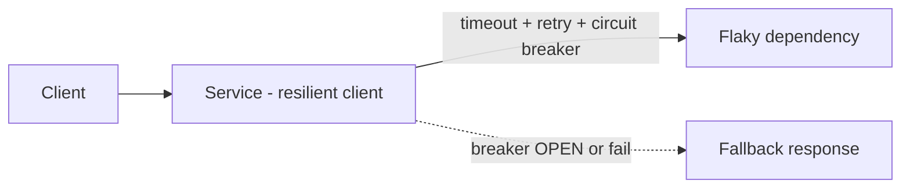

# Project: Make a Service Resilient

> Take a service that calls a flaky dependency and add the resilience patterns that stop one
> slow/failing dependency from taking everything down: **timeouts, retries with backoff, a
> circuit breaker, and a fallback**.

⏱️ ~20 min · 💰 free locally · 🐳 Docker · 🐍 Python · ☁️ AWS optional

## What you'll build


## Concepts you connect
- [Circuit breaker, bulkhead, retries](../1-knowledge/patterns/resilience-patterns.md)
- Timeouts & graceful degradation
- [Availability](../1-knowledge/fundamentals/availability-reliability.md)

## Build it locally (🐳)

**1. `dependency.py`** — a deliberately unreliable downstream service:
```python
import time, random
from flask import Flask
app = Flask(__name__)
@app.get("/data")
def data():
    r = random.random()
    if r < 0.5: time.sleep(5)          # 50% hang (slow)
    if r < 0.7: return {"error": "boom"}, 500   # often errors
    return {"data": "ok"}
```

**2. `api.py`** — resilient client (timeout + retry + circuit breaker + fallback):
```python
import requests, pybreaker
from flask import Flask
app = Flask(__name__)

# open the breaker after 3 consecutive failures; stay open 10s
breaker = pybreaker.CircuitBreaker(fail_max=3, reset_timeout=10)
DEP = "http://dependency:5000/data"

@breaker
def call_dep():
    # timeout so a hung dependency fails fast instead of blocking us
    r = requests.get(DEP, timeout=1)
    r.raise_for_status()
    return r.json()

@app.get("/")
def handler():
    for attempt in range(2):                 # 1 retry
        try:
            return {"result": call_dep(), "breaker": breaker.current_state}
        except pybreaker.CircuitBreakerError:
            break                            # breaker OPEN -> don't even try
        except Exception:
            continue
    # fallback / graceful degradation
    return {"result": "(cached/default)", "breaker": breaker.current_state, "degraded": True}
```

**3. `docker-compose.yml`:**
```yaml
services:
  dependency:
    image: python:3.12-slim
    volumes: [ "./dependency.py:/app/dependency.py" ]
    working_dir: /app
    command: sh -c "pip install flask -q && flask run --host 0.0.0.0"
    environment: { FLASK_APP: dependency.py }
  api:
    image: python:3.12-slim
    volumes: [ "./api.py:/app/api.py" ]
    working_dir: /app
    command: sh -c "pip install flask requests pybreaker -q && flask run --host 0.0.0.0"
    environment: { FLASK_APP: api.py }
    ports: [ "5000:5000" ]
    depends_on: [ dependency ]
```

```bash
docker compose up -d
sleep 6
```

## Run the end-to-end flow
```bash
# Hammer the API; watch breaker state and degraded responses
for i in $(seq 1 20); do curl -s localhost:5000/ ; echo; sleep 0.3; done
```

## What to observe & why
- **Timeout:** when the dependency hangs (5s), the client gives up after **1s** instead of
  blocking — a slow dependency can't tie up your threads.
- **Retry:** transient errors are retried once before failing.
- **Circuit breaker:** after 3 consecutive failures the breaker flips to **`open`** — now
  calls **fail fast** (no waiting on a known-bad dependency) and the API immediately returns
  the **fallback** (`degraded: true`). After 10s it goes **`half-open`** and tries again;
  success closes it.
- The API **never stops responding** — it degrades gracefully instead of hanging or
  cascading the failure to its callers.

## Deploy / scale on AWS (☁️)
- A **service mesh** (App Mesh / Envoy / Istio) provides timeouts, retries, and circuit
  breaking **at the infra layer** — no app code. Libraries (**resilience4j**, **Polly**,
  **pybreaker**) do it in-process.
- Pair with **SQS** + DLQ for async retries, **auto scaling** for load, and **health
  checks** so the LB removes bad instances.

## Observe & break it
1. **Trip the breaker:** make the dependency 100% errors and watch it open fast, then serve
   only fallbacks — your latency stays low (fail-fast) instead of piling up.
2. **Recovery:** make the dependency healthy and watch the breaker go half-open → closed.
3. **Bulkhead:** add a second dependency with its own breaker so one failing dependency can't
   exhaust resources shared with the other.

## Mirrors
[Netflix Hystrix](../2-case-studies/companies/netflix.md) / service-mesh resilience; the
[resilience patterns knowledge doc](../1-knowledge/patterns/resilience-patterns.md).

## Teardown
```bash
docker compose down
```
