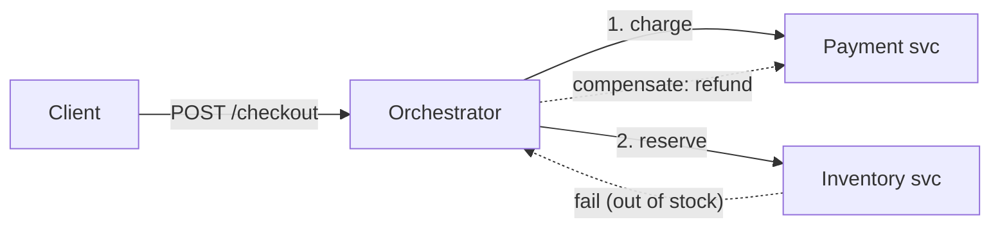

# Project: Saga / Distributed Transaction

> Build a checkout that spans three services (order, payment, inventory) with **no shared
> database**, and keep data consistent using the **saga pattern** — local transactions plus
> **compensating actions** when a later step fails.

⏱️ ~25 min · 💰 free locally · 🐳 Docker · 🐍 Python · ☁️ AWS optional

## What you'll build
An **orchestrated** saga: an orchestrator drives the steps and undoes earlier ones if a
later step fails.



Each service commits its **own** local transaction; there's no 2-phase commit across them.
If step 2 fails, the orchestrator runs **compensations** for step 1.

## Concepts you connect
- [Saga pattern](../1-knowledge/patterns/saga.md) (orchestration + compensation)
- [Microservices](../1-knowledge/patterns/monolith-vs-microservices.md) (own-database-per-service)
- Idempotency (compensations must be safe to retry)

## Build it locally (🐳)

**1. `payment.py`** — charge + refund (compensation):
```python
from flask import Flask, request
app = Flask(__name__); charged = {}
@app.post("/charge")
def charge():
    d = request.json; charged[d["order"]] = d["amount"]
    print(f"[payment] charged {d['amount']} for {d['order']}")
    return {"status": "charged"}
@app.post("/refund")                                   # compensation
def refund():
    d = request.json; charged.pop(d["order"], None)
    print(f"[payment] REFUNDED {d['order']}")
    return {"status": "refunded"}
```

**2. `inventory.py`** — reserve (may fail) + release:
```python
from flask import Flask, request
app = Flask(__name__); stock = {"widget": 5, "gadget": 0}   # gadget is out of stock
@app.post("/reserve")
def reserve():
    d = request.json; item = d["item"]
    if stock.get(item, 0) <= 0:
        print(f"[inventory] OUT OF STOCK: {item}")
        return {"status": "failed"}, 409               # triggers compensation
    stock[item] -= 1; print(f"[inventory] reserved {item}")
    return {"status": "reserved"}
@app.post("/release")                                   # compensation
def release():
    d = request.json; stock[d["item"]] = stock.get(d["item"], 0) + 1
    return {"status": "released"}
```

**3. `orchestrator.py`** — drive the saga, compensate on failure:
```python
import os, requests
from flask import Flask, request
app = Flask(__name__)
PAY = "http://payment:5000"; INV = "http://inventory:5000"

@app.post("/checkout")
def checkout():
    d = request.json; order = d["order"]
    # step 1: charge
    requests.post(f"{PAY}/charge", json={"order": order, "amount": d["amount"]})
    # step 2: reserve stock
    resp = requests.post(f"{INV}/reserve", json={"order": order, "item": d["item"]})
    if resp.status_code != 200:
        # COMPENSATE step 1
        requests.post(f"{PAY}/refund", json={"order": order})
        return {"status": "ABORTED", "reason": "out of stock — payment refunded"}, 409
    return {"status": "CONFIRMED"}
```

**4. `docker-compose.yml`:**
```yaml
services:
  payment:
    image: python:3.12-slim
    volumes: [ "./payment.py:/app/payment.py" ]
    working_dir: /app
    command: sh -c "pip install flask -q && flask run --host 0.0.0.0"
    environment: { FLASK_APP: payment.py }
  inventory:
    image: python:3.12-slim
    volumes: [ "./inventory.py:/app/inventory.py" ]
    working_dir: /app
    command: sh -c "pip install flask -q && flask run --host 0.0.0.0"
    environment: { FLASK_APP: inventory.py }
  orchestrator:
    image: python:3.12-slim
    volumes: [ "./orchestrator.py:/app/orchestrator.py" ]
    working_dir: /app
    command: sh -c "pip install flask requests -q && flask run --host 0.0.0.0"
    environment: { FLASK_APP: orchestrator.py }
    ports: [ "5000:5000" ]
    depends_on: [ payment, inventory ]
```

```bash
docker compose up -d
sleep 8
```

## Run the end-to-end flow
```bash
# Happy path: widget is in stock -> CONFIRMED
curl -s -X POST localhost:5000/checkout -H 'content-type: application/json' \
  -d '{"order":"o1","item":"widget","amount":50}'

# Failure path: gadget is out of stock -> charge happens, reserve fails, payment REFUNDED
curl -s -X POST localhost:5000/checkout -H 'content-type: application/json' \
  -d '{"order":"o2","item":"gadget","amount":80}'

docker compose logs payment inventory | tail -20
```

## What to observe & why
- **Happy path:** payment charges, inventory reserves, order is `CONFIRMED` — two
  independent local transactions across two services, no distributed lock.
- **Failure path:** payment charges `o2`, inventory **fails** (out of stock), and the
  orchestrator runs the **compensation** (`/refund`) so the customer isn't charged for an
  order that didn't happen. The logs show `charged` then `REFUNDED`.
- There's a brief window where `o2` was charged-but-not-yet-refunded — **no isolation**
  across services means intermediate states are visible; sagas accept this and fix it with
  compensation (vs a single ACID transaction).

## Deploy / scale on AWS (☁️)
| Local | AWS managed |
| --- | --- |
| orchestrator | **AWS Step Functions** (a managed saga/state machine with built-in retries + catch/compensate) |
| services | Lambda / ECS, each with its **own** datastore |
| async variant | **EventBridge/SQS** for choreography (services react to events) |

Step Functions is the common managed way to run sagas: each state can have a `Catch` that
triggers compensating states.

## Observe & break it
1. **Make payment fail** instead of inventory and confirm no inventory was reserved (order
   the steps so each failure compensates all prior ones).
2. **Idempotent compensation:** call `/refund` twice — it's safe (no double refund). Saga
   steps and compensations **must** be idempotent because they get retried.
3. **Choreography version:** replace the orchestrator with events (each service emits
   `Charged`/`Reserved`/`Failed` and reacts) to feel the trade-off — decentralized but
   harder to follow.

## Mirrors
Distributed transactions in microservices: checkout (order→payment→inventory→shipping),
travel booking (flight+hotel+car). See the [saga knowledge doc](../1-knowledge/patterns/saga.md).

## Teardown
```bash
docker compose down
```
