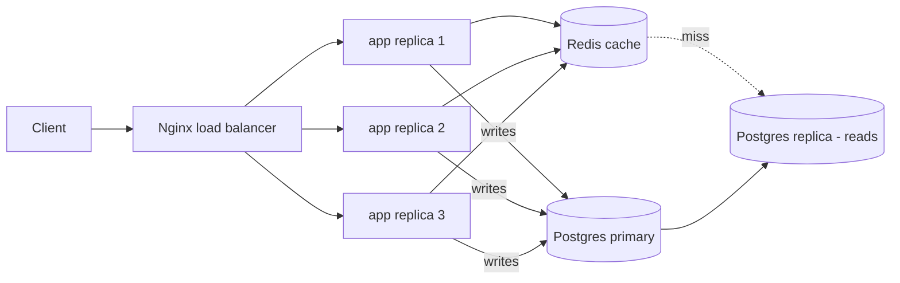

# Project: Scalable Web Service

> Build the canonical scalable web tier and watch all the pieces work together: a **load
> balancer** spreading traffic across **stateless app replicas**, a **Redis cache** in
> front of a **replicated Postgres** (writes → primary, reads → replica).

⏱️ ~25 min · 💰 free locally · 🐳 Docker · 🐍 Python · ☁️ AWS optional

## What you'll build


This is the bread-and-butter web architecture: **stateless** app servers (so any replica
serves any request) + **read scaling** (cache + replica) + **write to primary**.

## Concepts you connect
- [Load balancing](../1-knowledge/building-blocks/load-balancers.md) + statelessness
- [Caching](../1-knowledge/building-blocks/caching.md) (cache-aside)
- [Replication](../1-knowledge/data-storage/replication.md) (read replica)

## Build it locally (🐳)

**1. `app.py`** — a stateless service: write to primary, read via cache→replica:
```python
import os, socket, redis, psycopg2
from flask import Flask, request
app = Flask(__name__)
r = redis.Redis(host="redis", port=6379)
def primary(): return psycopg2.connect(os.environ["PRIMARY"])
def replica(): return psycopg2.connect(os.environ["REPLICA"])

@app.post("/items")
def create():
    name = request.json["name"]
    con = primary(); cur = con.cursor()
    cur.execute("INSERT INTO items(name) VALUES(%s) RETURNING id",(name,))
    iid = cur.fetchone()[0]; con.commit()
    r.delete(f"item:{iid}")                      # invalidate
    return {"id": iid, "served_by": socket.gethostname()}, 201

@app.get("/items/<int:iid>")
def get(iid):
    cached = r.get(f"item:{iid}")                # 1. cache
    if cached: src = "cache"; name = cached.decode()
    else:
        cur = replica().cursor()                 # 2. miss -> READ REPLICA
        cur.execute("SELECT name FROM items WHERE id=%s",(iid,)); row = cur.fetchone()
        if not row: return {"error":"not found"}, 404
        name = row[0]; r.setex(f"item:{iid}", 300, name); src = "replica"
    return {"id": iid, "name": name, "source": src, "served_by": socket.gethostname()}
```

**2. `nginx.conf`** — load-balance across app replicas (Docker DNS round-robin):
```nginx
events {}
http {
  resolver 127.0.0.11 valid=10s;                 # Docker's DNS
  server {
    listen 80;
    location / {
      set $upstream app:5000;                    # resolves to all replica IPs
      proxy_pass http://$upstream;
    }
  }
}
```

**3. `db.sql`:** `CREATE TABLE items (id SERIAL PRIMARY KEY, name TEXT);`

**4. `docker-compose.yml`** (primary + replica + redis + 3 app replicas + LB):
```yaml
services:
  primary:
    image: bitnami/postgresql:16
    environment:
      POSTGRESQL_REPLICATION_MODE: master
      POSTGRESQL_REPLICATION_USER: repl
      POSTGRESQL_REPLICATION_PASSWORD: replpass
      POSTGRESQL_USERNAME: app
      POSTGRESQL_PASSWORD: apppass
      POSTGRESQL_DATABASE: appdb
    volumes: [ "./db.sql:/docker-entrypoint-initdb.d/db.sql" ]
  replica:
    image: bitnami/postgresql:16
    depends_on: [ primary ]
    environment:
      POSTGRESQL_REPLICATION_MODE: slave
      POSTGRESQL_REPLICATION_USER: repl
      POSTGRESQL_REPLICATION_PASSWORD: replpass
      POSTGRESQL_MASTER_HOST: primary
      POSTGRESQL_MASTER_PORT_NUMBER: 5432
      POSTGRESQL_PASSWORD: apppass
  redis: { image: redis:7-alpine }
  app:
    image: python:3.12-slim
    volumes: [ "./app.py:/app/app.py" ]
    working_dir: /app
    command: sh -c "pip install flask redis psycopg2-binary -q && flask run --host 0.0.0.0"
    environment:
      FLASK_APP: app.py
      PRIMARY: "host=primary dbname=appdb user=app password=apppass"
      REPLICA: "host=replica dbname=appdb user=app password=apppass"
    deploy: { replicas: 3 }                       # 3 stateless replicas
    depends_on: [ primary, replica, redis ]
  lb:
    image: nginx:alpine
    volumes: [ "./nginx.conf:/etc/nginx/nginx.conf:ro" ]
    ports: [ "8080:80" ]
    depends_on: [ app ]
```

```bash
docker compose up -d
sleep 18   # replication + app start
```

## Run the end-to-end flow
```bash
# Create items (writes go to the PRIMARY) — note which replica served each
for n in apple banana cherry; do
  curl -s -X POST localhost:8080/items -H 'content-type: application/json' -d "{\"name\":\"$n\"}"
  echo
done

# Read an item repeatedly — load-balanced across replicas; cache vs replica source
for i in $(seq 1 6); do curl -s localhost:8080/items/1; echo; done
```

## What to observe & why
- `served_by` rotates across the 3 app replicas — the **load balancer** spreads requests,
  and because the app is **stateless** (no local session), any replica handles any request.
- The **first** read of an item shows `"source":"replica"` (cache miss → read replica);
  **subsequent** reads show `"source":"cache"` — reads are offloaded from the DB.
- **Writes** go to the **primary**; the **replica** serves reads. Replication keeps the
  replica in sync (with small lag). This is read scaling + write isolation in one picture.

## Deploy / scale on AWS (☁️)
| Local | AWS managed |
| --- | --- |
| Nginx LB | **ALB** |
| app replicas | **ECS/EKS** or EC2 in an **Auto Scaling Group** |
| Redis | **ElastiCache** |
| primary + replica | **RDS** (Multi-AZ + read replicas) |

The textbook AWS web tier: `Route 53 → ALB → ASG of stateless containers → ElastiCache →
RDS (primary + read replicas)`.

## Observe & break it
1. **Lose a replica:** `docker compose stop` one app container — the LB routes around it,
   requests keep succeeding (no user impact) because the app is stateless.
2. **Cache offload:** flush Redis and watch reads briefly hit the replica again, then warm
   back up.
3. **Replication lag:** write then immediately read by id — if you bypass the cache you may
   briefly read stale from the replica (route recent-read to primary if needed).
4. **Scale out:** raise `replicas: 5` and re-run; more `served_by` hostnames appear.

## Mirrors
Essentially every web product's core tier; underpins the
[URL shortener](../2-case-studies/url-shortener.md), [news feed](../2-case-studies/news-feed.md),
etc.

## Teardown
```bash
docker compose down -v
```
