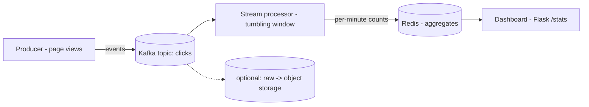

# Project: Real-Time Streaming Data Pipeline

> Build a pipeline that ingests a continuous stream of events, processes them in real time
> with **windowed aggregation**, stores the results, and shows a live dashboard — the
> pattern behind analytics, metrics, fraud detection, and dashboards everywhere.

⏱️ ~30–40 min · 💰 free locally · 🐳 Docker · 🐍 Python · ☁️ AWS optional

## What you'll build
A clickstream analytics pipeline: a producer emits page-view events, a stream processor
aggregates them into per-minute counts, and a dashboard reads the live results.



The key idea: **unbounded** events come in continuously; the processor turns them into
**bounded, query-able aggregates** without ever storing-then-batch-processing.

## Concepts you connect
- [Message queues & pub/sub](../1-knowledge/building-blocks/message-queues.md) (Kafka as a
  replayable log)
- [Event-driven architecture](../1-knowledge/patterns/event-driven.md)
- Stream processing & **windowing** (tumbling windows)
- [Caching](../1-knowledge/building-blocks/caching.md) (Redis serving live aggregates)

## Build it locally (🐳)

**1. `producer.py`** — emit random page-view events forever:
```python
import os, json, time, random
from kafka import KafkaProducer
p = KafkaProducer(bootstrap_servers=os.environ["KAFKA"],
                  value_serializer=lambda v: json.dumps(v).encode())
PAGES = ["/home", "/product", "/cart", "/checkout", "/blog"]
while True:
    evt = {"page": random.choice(PAGES), "user": random.randint(1, 1000),
           "ts": time.time()}
    p.send("clicks", evt)
    time.sleep(0.1)        # ~10 events/sec
```

**2. `processor.py`** — consume the stream, aggregate per 10-second tumbling window:
```python
import os, json, time
from collections import defaultdict
from kafka import KafkaConsumer
import redis

c = KafkaConsumer("clicks", bootstrap_servers=os.environ["KAFKA"],
                  value_deserializer=lambda b: json.loads(b), group_id="agg")
r = redis.Redis(host="redis", port=6379)

WINDOW = 10
counts = defaultdict(int)
window_start = int(time.time()) // WINDOW * WINDOW

for msg in c:
    now = int(time.time())
    bucket = now // WINDOW * WINDOW
    if bucket != window_start:                 # window rolled over -> flush
        key = f"clicks:{window_start}"
        r.hset(key, mapping={p: n for p, n in counts.items()})
        r.expire(key, 3600)
        print(f"[processor] window {window_start}: {dict(counts)}")
        counts.clear(); window_start = bucket
    counts[msg.value["page"]] += 1             # aggregate in-window
```

**3. `dashboard.py`** — Flask app serving the latest windows:
```python
import os, time, redis
from flask import Flask
app = Flask(__name__); r = redis.Redis(host="redis", port=6379)

@app.get("/stats")
def stats():
    now = int(time.time()); out = {}
    for w in range(now - 60, now, 10):            # last ~6 windows
        ws = w // 10 * 10
        data = r.hgetall(f"clicks:{ws}")
        if data:
            out[ws] = {k.decode(): int(v) for k, v in data.items()}
    return out
```

**4. `docker-compose.yml`:**
```yaml
services:
  kafka:
    image: bitnami/kafka:3.7
    environment:
      KAFKA_CFG_NODE_ID: "0"
      KAFKA_CFG_PROCESS_ROLES: controller,broker
      KAFKA_CFG_CONTROLLER_QUORUM_VOTERS: "0@kafka:9093"
      KAFKA_CFG_LISTENERS: "PLAINTEXT://:9092,CONTROLLER://:9093"
      KAFKA_CFG_ADVERTISED_LISTENERS: "PLAINTEXT://kafka:9092"
      KAFKA_CFG_CONTROLLER_LISTENER_NAMES: "CONTROLLER"
      KAFKA_CFG_OFFSETS_TOPIC_REPLICATION_FACTOR: "1"
  redis: { image: redis:7-alpine }
  producer:
    image: python:3.12-slim
    volumes: [ "./producer.py:/app/producer.py" ]
    working_dir: /app
    command: sh -c "pip install kafka-python -q && sleep 12 && python producer.py"
    environment: { KAFKA: "kafka:9092" }
    depends_on: [ kafka ]
  processor:
    image: python:3.12-slim
    volumes: [ "./processor.py:/app/processor.py" ]
    working_dir: /app
    command: sh -c "pip install kafka-python redis -q && sleep 12 && python processor.py"
    environment: { KAFKA: "kafka:9092" }
    depends_on: [ kafka, redis ]
  dashboard:
    image: python:3.12-slim
    volumes: [ "./dashboard.py:/app/dashboard.py" ]
    working_dir: /app
    command: sh -c "pip install flask redis -q && flask run --host 0.0.0.0"
    environment: { FLASK_APP: dashboard.py }
    ports: [ "5000:5000" ]
    depends_on: [ redis ]
```

```bash
docker compose up -d
sleep 20   # kafka + installs
```

## Run the end-to-end flow
```bash
# Watch the processor flush windows
docker compose logs -f processor &

# Poll the live dashboard a few times
for i in 1 2 3; do curl -s localhost:5000/stats; echo; sleep 10; done
```

## What to observe & why
- The producer emits ~10 events/sec **continuously** — an unbounded stream.
- Every 10s the processor **flushes a window**: it turned a firehose of raw events into a
  compact per-page count and wrote it to Redis. You never stored every event to query
  later — you **processed it as it flowed** (the essence of stream vs batch).
- `/stats` returns the last few windows' counts and updates every 10s — a **real-time**
  view backed by the aggregates, not by scanning raw data.

## Deploy / scale on AWS (☁️)
| Local | AWS managed |
| --- | --- |
| Kafka | **Kinesis Data Streams** (or **MSK**) |
| processor (windowing) | **Kinesis Data Analytics (Flink)** or **Lambda** |
| Redis aggregates | **DynamoDB** / **ElastiCache** / **Timestream** |
| dashboard | **QuickSight** / API Gateway + Lambda |
| raw archive | **Kinesis Firehose → S3** |

Typical real pipeline: `producers → Kinesis/Kafka → Flink (windowed aggregation) →
DynamoDB/OLAP → dashboard`, with Firehose teeing raw events to S3 for batch/ML later (the
**Lambda/Kappa architecture**).

## Observe & break it
1. **Scale consumers:** give the topic 3 partitions and run `--scale processor=3` in one
   consumer group — partitions split across them (parallel stream processing). *(Note: the
   simple in-memory windowing here aggregates per-instance; real frameworks like Flink keep
   keyed state — call that out as the next step.)*
2. **Replay:** Kafka keeps events; reset the consumer group offset to reprocess history into
   the aggregates — impossible with a delete-on-read queue.
3. **Backpressure:** speed the producer to 1000/s and watch the processor lag (consumer
   offset falls behind) — the log buffers, nothing is lost.

## Extend it
- Add **windowed unique users** with Redis HyperLogLog (approximate counting at scale).
- Tee raw events to **object storage** (the [video/image projects](./project-image-processing.md)
  use the same idea) for batch reprocessing.
- Swap the hand-rolled window for **Kafka Streams / Faust / Flink** to get fault-tolerant
  keyed state.

## Mirrors
This is how **view counts** in the [video streaming case study](../2-case-studies/video-streaming.md),
metrics pipelines, and fraud/anomaly detection work — and the
[ride-sharing](../2-case-studies/ride-sharing.md) location/surge stream.

## Teardown
```bash
docker compose down -v
```
