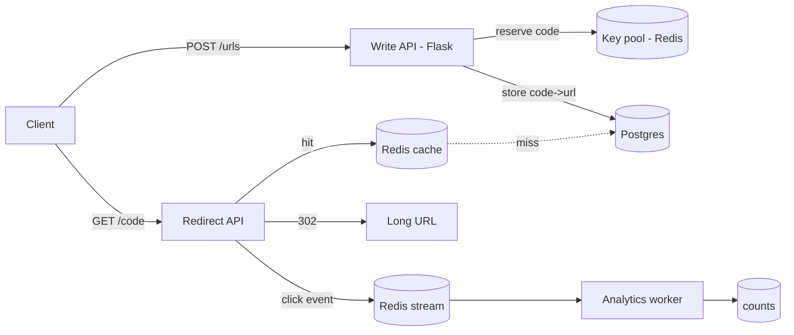

# Project: URL Shortener, End to End

> Build a working URL shortener that connects the pieces from the
> [case study](../2-case-studies/url-shortener.md): a write API with pre-generated keys, a
> cache-fronted redirect path, and an async click-analytics stream.

⏱️ ~30 min · 💰 free locally · 🐳 Docker · 🐍 Python · ☁️ AWS optional

## What you'll build


The redirect path is **cache-first** (fast, read-heavy); analytics are **async** (off the
hot path); codes come from a **pre-generated pool** (no collision check on write).

## Concepts you connect
- [Key-value store](../2-case-studies/key-value-store.md) / KGS — pre-generated codes
- [Caching](../1-knowledge/building-blocks/caching.md) — cache-aside redirects
- [Sync vs async](../1-knowledge/communication/sync-vs-async.md) — async analytics
- The full [URL shortener case study](../2-case-studies/url-shortener.md)

## Build it locally (🐳)

**1. `db.sql`:**
```sql
CREATE TABLE urls (code TEXT PRIMARY KEY, long_url TEXT NOT NULL, created_at TIMESTAMPTZ DEFAULT now());
```

**2. `keygen.py`** — fill a pool of random codes (the KGS, run once at startup):
```python
import os, redis, secrets, string
r = redis.Redis(host="redis", port=6379)
ALPHABET = string.ascii_letters + string.digits
def code(): return "".join(secrets.choice(ALPHABET) for _ in range(7))
if r.scard("keys:available") < 1000:
    pipe = r.pipeline()
    for _ in range(5000): pipe.sadd("keys:available", code())
    pipe.execute()
print("[keygen] pool filled:", r.scard("keys:available"))
```

**3. `api.py`** — write + redirect + async click events:
```python
import os, json, time, redis, psycopg2
from flask import Flask, request, redirect
app = Flask(__name__)
r = redis.Redis(host="redis", port=6379)
def db(): return psycopg2.connect(os.environ["DB"])

@app.post("/urls")
def shorten():
    long_url = request.json["long_url"]
    code = r.spop("keys:available").decode()      # take a pre-generated key (O(1), no collision)
    con = db(); con.cursor().execute(
        "INSERT INTO urls(code,long_url) VALUES(%s,%s)", (code, long_url)); con.commit()
    return {"short_url": f"http://localhost:5000/{code}"}, 201

@app.get("/<code>")
def go(code):
    url = r.get(f"u:{code}")                       # 1. cache check
    if not url:
        cur = db().cursor(); cur.execute("SELECT long_url FROM urls WHERE code=%s",(code,))
        row = cur.fetchone()
        if not row: return {"error":"not found"}, 404
        url = row[0]; r.setex(f"u:{code}", 3600, url)   # 2. populate cache
    else:
        url = url.decode()
    r.xadd("clicks", {"code": code, "ts": time.time()})  # 3. async click event (off hot path)
    return redirect(url, code=302)
```

**4. `analytics.py`** — consume the click stream, aggregate counts:
```python
import redis
r = redis.Redis(host="redis", port=6379)
last = "0"
while True:
    for _, msgs in r.xread({"clicks": last}, block=5000, count=100) or []:
        for mid, fields in msgs:
            r.hincrby("clickcount", fields[b"code"].decode(), 1)
            last = mid
```

**5. `docker-compose.yml`:**
```yaml
services:
  db:
    image: postgres:16-alpine
    environment: { POSTGRES_PASSWORD: pass, POSTGRES_DB: short }
    volumes: [ "./db.sql:/docker-entrypoint-initdb.d/db.sql" ]
  redis: { image: redis:7-alpine }
  api:
    image: python:3.12-slim
    volumes: [ "./api.py:/app/api.py", "./keygen.py:/app/keygen.py" ]
    working_dir: /app
    command: sh -c "pip install flask redis psycopg2-binary -q && sleep 6 && python keygen.py && flask run --host 0.0.0.0"
    environment: { FLASK_APP: api.py, DB: "host=db dbname=short user=postgres password=pass" }
    ports: [ "5000:5000" ]
    depends_on: [ db, redis ]
  analytics:
    image: python:3.12-slim
    volumes: [ "./analytics.py:/app/analytics.py" ]
    working_dir: /app
    command: sh -c "pip install redis -q && sleep 8 && python analytics.py"
    depends_on: [ redis ]
```

```bash
docker compose up -d
sleep 12
```

## Run the end-to-end flow
```bash
# Shorten a URL
SHORT=$(curl -s -X POST localhost:5000/urls -H 'content-type: application/json' \
  -d '{"long_url":"https://example.com/some/really/long/path"}' | python -c "import sys,json;print(json.load(sys.stdin)['short_url'])")
echo $SHORT

# Follow it a few times (note -L to follow the 302)
CODE=$(basename $SHORT)
for i in $(seq 1 5); do curl -s -o /dev/null -w "%{http_code} " -L localhost:5000/$CODE; done; echo

# Check the async click count
docker compose exec redis redis-cli hget clickcount $CODE
```

## What to observe & why
- Creating a link **pops a ready-made code** from the Redis pool (`SPOP`) — no "does this
  code exist?" check, no collision handling on the write path. That's the **KGS** pattern.
- The first redirect is a DB read that **populates the cache**; subsequent redirects are
  served from Redis (`u:<code>`) — the cache-aside read path that keeps 100:1-read traffic
  off Postgres.
- The click count is updated by the **analytics worker** reading a Redis **stream**, not by
  the redirect itself — analytics never slow the `302`.

## Deploy / scale on AWS (☁️)
| Local | AWS managed |
| --- | --- |
| Postgres | **DynamoDB** (code = partition key) |
| Redis cache | **ElastiCache** / DynamoDB DAX |
| Redis key pool | a DynamoDB table or pre-gen Lambda |
| Redis stream | **Kinesis** / SQS |
| analytics worker | **Lambda** |
| API | **API Gateway + Lambda** |

Real shorteners put the redirect behind a **CDN** (the redirect is highly cacheable) and
use a KV store keyed by code. See the
[case study](../2-case-studies/url-shortener.md) for 301-vs-302, hot keys, etc.

## Observe & break it
1. **Cache effect:** `redis-cli del u:<code>`, then time the next redirect (DB read) vs the
   one after (cache hit).
2. **Analytics is decoupled:** stop the analytics worker, keep clicking — redirects still
   work; counts just stop updating until you restart it (the stream buffers).
3. **Key exhaustion:** drain the pool and watch creation fail gracefully → triggers a
   refill (extend `keygen` to run periodically).

## Extend it
- Add **custom aliases** (`SETNX` the code) and **expiry** (`expires_at` + lazy 404).
- Front the redirect with the [CDN idea](./project-video-streaming.md) (Nginx cache).
- Replace the count with the [streaming data pipeline](./project-streaming-data.md) for
  geo/referrer analytics.

## Mirrors
The [URL shortener case study](../2-case-studies/url-shortener.md), end to end.

## Teardown
```bash
docker compose down -v
```
