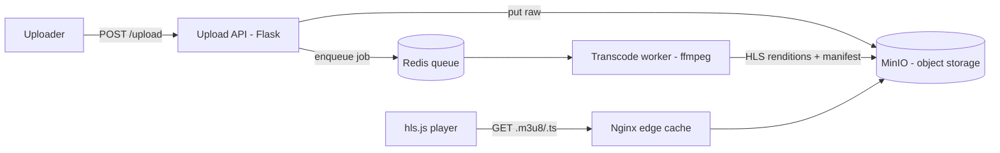

# Project: Video Streaming (VOD)

> Build a scaled-down video-on-demand service: upload a video, transcode it into
> adaptive-bitrate HLS in the background, store the segments, and play them back in a
> browser with quality that adapts to bandwidth — the YouTube/Netflix pipeline in miniature.

⏱️ ~40–50 min · 💰 free locally · 🐳 Docker · 🐍 Python + ffmpeg · ☁️ AWS optional

## What you'll build


The upload returns immediately; transcoding happens **asynchronously**; playback streams
**segments** at a bitrate the player picks based on bandwidth (**ABR**).

## Concepts you connect
- [Object storage](../1-knowledge/data-storage/object-storage.md) (MinIO = S3-compatible)
- [CDN](../1-knowledge/building-blocks/cdn.md) (Nginx caching the segments)
- [Message queues](../1-knowledge/building-blocks/message-queues.md) (async transcode jobs)
- Adaptive bitrate streaming (HLS) — from the
  [video streaming case study](../2-case-studies/video-streaming.md)

## Build it locally (🐳)

**1. `api.py`** — accept an upload, store raw, enqueue a transcode job:
```python
import os, uuid, redis, boto3
from flask import Flask, request
app = Flask(__name__)
s3 = boto3.client("s3", endpoint_url="http://minio:9000",
                  aws_access_key_id="minioadmin", aws_secret_access_key="minioadmin")
q = redis.Redis(host="redis", port=6379)
try: s3.create_bucket(Bucket="videos")
except Exception: pass

@app.post("/upload")
def upload():
    vid = str(uuid.uuid4())[:8]
    s3.put_object(Bucket="videos", Key=f"{vid}/source.mp4",
                  Body=request.get_data())     # raw bytes in the body
    q.lpush("transcode", vid)                   # enqueue job
    return {"video_id": vid, "status": "PROCESSING"}, 202
```

**2. `worker.py`** — pull a job, transcode to multi-bitrate HLS with ffmpeg, upload:
```python
import os, subprocess, tempfile, redis, boto3
s3 = boto3.client("s3", endpoint_url="http://minio:9000",
                  aws_access_key_id="minioadmin", aws_secret_access_key="minioadmin")
q = redis.Redis(host="redis", port=6379)

while True:
    _, vid = q.brpop("transcode"); vid = vid.decode()
    print(f"[worker] transcoding {vid}")
    with tempfile.TemporaryDirectory() as d:
        src = f"{d}/source.mp4"
        s3.download_file("videos", f"{vid}/source.mp4", src)
        # 2 renditions (360p, 720p) + a master playlist -> HLS segments
        subprocess.run([
            "ffmpeg","-i",src,
            "-filter_complex","[0:v]split=2[v1][v2];[v1]scale=w=640:h=360[v1o];[v2]scale=w=1280:h=720[v2o]",
            "-map","[v1o]","-c:v:0","libx264","-b:v:0","800k",
            "-map","[v2o]","-c:v:1","libx264","-b:v:1","2400k",
            "-f","hls","-hls_time","4","-hls_playlist_type","vod",
            "-master_pl_name","master.m3u8",
            "-var_stream_map","v:0 v:1",
            f"{d}/stream_%v.m3u8"
        ], check=True)
        for f in os.listdir(d):                  # upload all HLS artifacts
            if f.endswith((".m3u8",".ts")):
                s3.upload_file(f"{d}/{f}","videos",f"{vid}/hls/{f}",
                               ExtraArgs={"ACL":"public-read"})
    print(f"[worker] {vid} ready: /play/{vid}")
```

**3. `nginx.conf`** — an edge cache in front of MinIO (the "CDN"):
```nginx
events {}
http {
  proxy_cache_path /tmp/cache levels=1:2 keys_zone=cdn:10m max_size=1g;
  server {
    listen 80;
    location / {
      proxy_cache cdn;                       # cache segments at the "edge"
      add_header X-Cache $upstream_cache_status;
      proxy_pass http://minio:9000/videos/;
    }
  }
}
```

**4. `player.html`** — hls.js adaptive player (open it pointing at a video id):
```html
<video id="v" controls width="640"></video>
<script src="https://cdn.jsdelivr.net/npm/hls.js@latest"></script>
<script>
  const id = new URLSearchParams(location.search).get("id");
  const src = `http://localhost:8080/${id}/hls/master.m3u8`;   // via the Nginx cache
  const hls = new Hls(); hls.loadSource(src); hls.attachMedia(document.getElementById("v"));
</script>
```

**5. `docker-compose.yml`:**
```yaml
services:
  minio:
    image: minio/minio
    command: server /data --console-address ":9001"
    environment: { MINIO_ROOT_USER: minioadmin, MINIO_ROOT_PASSWORD: minioadmin }
    ports: [ "9001:9001" ]
  redis: { image: redis:7-alpine }
  api:
    image: python:3.12-slim
    volumes: [ "./api.py:/app/api.py" ]
    working_dir: /app
    command: sh -c "pip install flask boto3 redis -q && flask run --host 0.0.0.0"
    environment: { FLASK_APP: api.py }
    ports: [ "5000:5000" ]
    depends_on: [ minio, redis ]
  worker:
    image: python:3.12-slim
    volumes: [ "./worker.py:/app/worker.py" ]
    working_dir: /app
    command: sh -c "apt-get update -qq && apt-get install -y ffmpeg -qq && pip install boto3 redis -q && python worker.py"
    depends_on: [ minio, redis ]
  cdn:
    image: nginx:alpine
    volumes: [ "./nginx.conf:/etc/nginx/nginx.conf:ro" ]
    ports: [ "8080:80" ]
    depends_on: [ minio ]
```

```bash
docker compose up -d
sleep 20
```

## Run the end-to-end flow
```bash
# Upload any small .mp4 (returns immediately, 202 PROCESSING)
curl -s -X POST --data-binary @sample.mp4 localhost:5000/upload
# -> {"video_id":"ab12cd34","status":"PROCESSING"}

# Watch the worker transcode
docker compose logs -f worker

# When it prints "ready", open player.html in a browser:
#   file:///.../player.html?id=ab12cd34
# (the player streams http://localhost:8080/<id>/hls/master.m3u8)
```
> No mp4 handy? `ffmpeg -f lavfi -i testsrc=duration=10:size=1280x720:rate=30 sample.mp4`.

## What to observe & why
- `/upload` returns `202 PROCESSING` instantly — it only stored the raw file and queued a
  job. Transcoding (slow, CPU-heavy) happens **off the request path** in the worker.
- The worker produces **two renditions** (360p/720p) chopped into 4-second **`.ts`
  segments** plus `.m3u8` manifests. The player loads `master.m3u8` and **switches quality
  per segment** based on bandwidth (throttle your network in dev tools to watch it drop to
  360p).
- Re-request a segment and check the response header: `X-Cache: HIT` — Nginx served it from
  the **edge cache**, not MinIO. That's the CDN offload that makes video economical.

## Deploy / scale on AWS (☁️)
| Local | AWS managed |
| --- | --- |
| MinIO | **S3** |
| Redis queue | **SQS** |
| ffmpeg worker | **MediaConvert** (or ECS/Lambda + ffmpeg) |
| Nginx cache | **CloudFront** |
| upload | **S3 presigned URL** (client → S3 directly) |

Real pipeline: `presigned upload → S3 → (S3 event) → MediaConvert → HLS to S3 →
CloudFront → hls.js`, exactly the [video streaming case
study](../2-case-studies/video-streaming.md). Netflix extends the CDN with Open Connect.

## Observe & break it
1. **Async resilience:** stop the worker, upload 3 videos (they queue), start the worker —
   it drains the backlog. The upload path never broke.
2. **Scale transcoding:** `--scale worker=3` and upload several videos — they transcode in
   parallel (competing consumers), just like an autoscaled MediaConvert/ECS fleet.
3. **CDN value:** request a segment twice and compare `X-Cache: MISS` then `HIT`; the second
   never touches MinIO.

## Extend it
- Add a **metadata DB** (Postgres) tracking `video_id → status/renditions`, and a `GET
  /videos/{id}` that returns the manifest URL only when `READY`.
- Add a **view-count stream** (the [streaming data project](./project-streaming-data.md)).
- Use **presigned uploads** so large files go straight to storage (see
  [image processing](./project-image-processing.md)).

## Mirrors
The [video streaming case study](../2-case-studies/video-streaming.md) (YouTube/Netflix):
object storage + async transcoding + ABR + CDN.

## Teardown
```bash
docker compose down -v
```
