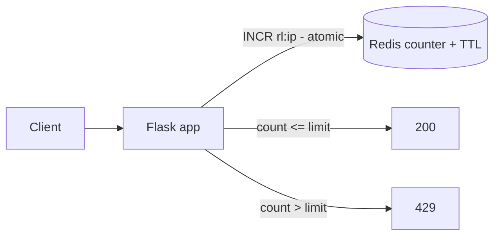

# Practice Lab: Rate Limiting with Redis

> Implement a distributed rate limiter in Redis and watch it reject requests past the
> limit — the same shared-counter approach used at API gateways.

## What you'll learn
- How to enforce **N requests per window** with a **shared** counter (works across many
  app instances).
- Why the **check-and-increment must be atomic** (and how `INCR` gives you that).
- The difference between **fixed-window** and **token-bucket** limiting.
- The hands-on version of [Rate limiting](../1-knowledge/building-blocks/rate-limiting.md)
  and the [rate limiter case study](../2-case-studies/rate-limiter.md).

⏱️ ~10 minutes · 💰 free · 🐳 Docker only

## Lab architecture


## Prerequisites
- Docker + Docker Compose. Port `5000` free.

## Setup

**1. `app.py`** — fixed-window limiter using atomic `INCR`:
```python
import redis
from flask import Flask, request
app = Flask(__name__)
r = redis.Redis(host="redis", port=6379)

LIMIT = 5         # requests
WINDOW = 10       # seconds

@app.get("/")
def index():
    client = request.remote_addr
    key = f"rl:{client}"
    count = r.incr(key)            # atomic increment (no read-modify-write race)
    if count == 1:
        r.expire(key, WINDOW)      # start the window on the first request
    if count > LIMIT:
        ttl = r.ttl(key)
        return {"error": "rate limited", "retry_after": ttl}, 429
    return {"ok": True, "count": count, "limit": LIMIT}
```

**2. `docker-compose.yml`:**
```yaml
services:
  redis: { image: redis:7-alpine }
  app:
    image: python:3.12-slim
    working_dir: /app
    volumes: [ "./app.py:/app/app.py" ]
    command: sh -c "pip install flask redis -q && flask run --host 0.0.0.0"
    ports: [ "5000:5000" ]
    depends_on: [ redis ]
```

**3. Bring it up:**
```bash
docker compose up -d
sleep 5
```

## Run it
```bash
# Fire 8 requests fast: first 5 -> 200, next 3 -> 429
for i in $(seq 1 8); do
  curl -s -o /dev/null -w "%{http_code}\n" localhost:5000/
done

# Wait for the window to reset, then it works again
sleep 10
curl -s -w "  <- %{http_code}\n" localhost:5000/
```

## What to observe & why
- The first **5** requests return `200` with an increasing `count`; requests **6–8**
  return `429`. The counter lives in Redis, so it's **shared** — even if you ran 10 app
  replicas, the limit would still be 5 total (not 5 per replica).
- `INCR` is **atomic**: Redis increments and returns the new value in one operation, so two
  concurrent requests can't both read "4" and both pass (the race from the
  [case study](../2-case-studies/rate-limiter.md), Problem 1).
- After the `WINDOW` TTL expires, the key vanishes and the count restarts — that's the
  fixed-window reset.

## Sample expected output
```
200
200
200
200
200
429
429
429
{"count":1,"limit":5,"ok":true}  <- 200
```

## Experiments to try
1. **Prove it's shared:** in two terminals, hit the endpoint alternately — the single
   counter still caps at 5 across both. (Conceptually the same as multiple app instances.)
2. **Boundary burst (the fixed-window flaw):** send 5 requests at the very end of a window
   and 5 at the start of the next — you'll get **10 in ~2 seconds**, double the rate. This
   is exactly why production often prefers token bucket / sliding window.
3. **Token bucket:** replace the logic with a Lua script storing `tokens` + `last_refill`
   so bursts up to a bucket size are allowed and refill at a steady rate.
4. **Response headers:** add `X-RateLimit-Remaining` / `Retry-After` and watch a client
   back off.

## Common pitfalls
- **Don't read-then-write in app code** (`get` then `set`) — it's a race; use atomic
  `INCR` or a Lua script.
- **Fail-open vs fail-closed:** if Redis is down, decide whether to allow or block. This
  lab would error; production wraps the Redis call and falls back to a local limit.
- **Per-IP keys behind a proxy/NAT** can lump many users together — key on API key/user ID
  when possible, and read the real client IP from `X-Forwarded-For`.

## Teardown
```bash
docker compose down
```

## In the real world (common production pattern)
- Rate limiting is usually enforced at the **API gateway / edge**, not deep in services —
  e.g. **Kong, AWS API Gateway usage plans, Envoy, Cloudflare**, NGINX `limit_req`.
- The counter store is almost always **Redis**, updated with an **atomic Lua script**
  implementing **token bucket** (burst-friendly) or **sliding window**.
- Public APIs (**Stripe, GitHub, Twitter**) return `429` + `X-RateLimit-*` / `Retry-After`
  headers so clients self-throttle.
- Tiered limits per plan (free vs paid), plus layered rules (per-second **and** per-day).
- Volumetric/DDoS traffic is handled upstream at the **CDN/WAF**, separate from
  application rate limiting.

## Connect to theory
- Concept: [Rate limiting](../1-knowledge/building-blocks/rate-limiting.md)
- Design: [Distributed rate limiter case study](../2-case-studies/rate-limiter.md)
- Managed equivalent: [API Gateway + Lambda lab](./aws/api-gateway-lambda.md) (usage-plan
  throttling).
