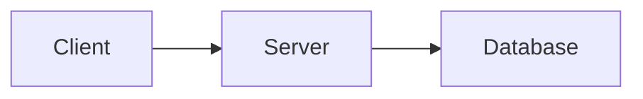

# <Topic Title>

> One-sentence summary of what this topic is about.

## Problem
What problem does this solve? Why does it matter?

## Core concepts
The key ideas. Add a diagram where it helps:

## Trade-offs
- ✅ Pros
- ⚠️ Cons
- When to use / when to avoid

## Real-world examples
How large-scale systems apply this in practice.

## References
- [Link](https://example.com)
